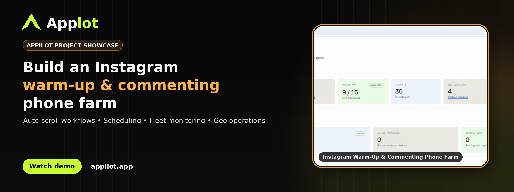
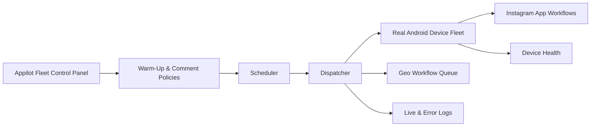
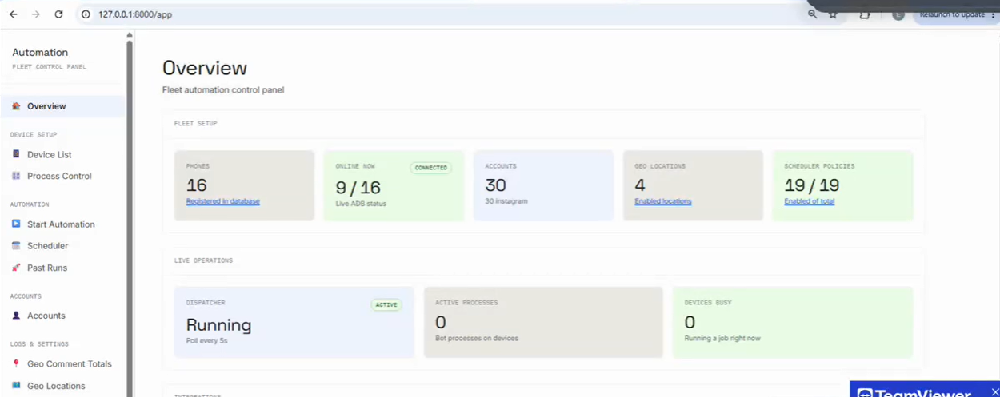
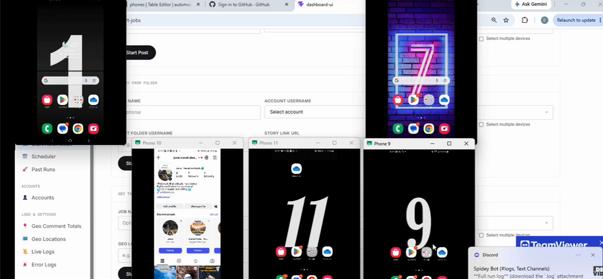
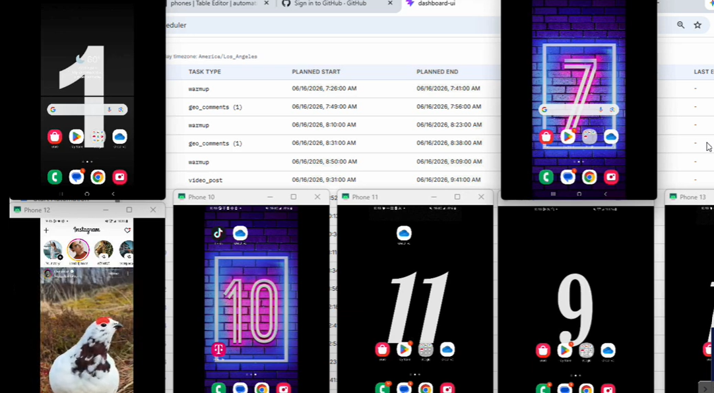

# Instagram Warm Up and Commenting Phone Farm 

**Appilot showcase for a real-device Instagram warm-up and commenting phone farm with auto-scroll workflows, scheduling, geo operations, and fleet monitoring.**

[](https://www.appilot.app/) [](https://youtu.be/6MhHnfxD8Cs)

## Demo Video

[](https://youtu.be/6MhHnfxD8Cs)

**Watch on YouTube:** https://youtu.be/6MhHnfxD8Cs

## Overview

Appilot showcase for a real-device Instagram warm-up and commenting phone farm with auto-scroll workflows, scheduling, geo operations, and fleet monitoring. The project was built as a custom Appilot engagement to coordinate mobile workflows from a central operations layer while keeping device state, scheduling and run visibility easy for an operator to review.

## Core Capabilities

| Capability | What it provides |
|---|---|
| **Phone-farm fleet management** | View connected devices, availability and current execution state from one dashboard. |
| **Instagram auto-scroll workflows** | Schedule controlled feed-navigation sessions on managed accounts. |
| **Commenting workflows** | Coordinate approved commenting jobs with configurable targets and operational limits. |
| **Geo-aware job organization** | Group location-oriented workflows and reporting in the same operations panel. |
| **Scheduler policies** | Define planned start and end windows for warm-up, comment and content jobs. |
| **Logs and run history** | Review live status, completed runs and errors across the device fleet. |

## Architecture



## Workflow

1. Connect authorized Android devices to the Appilot fleet.
2. Assign managed accounts and define warm-up or commenting policies.
3. Schedule approved jobs with clear time windows and operational limits.
4. Dispatch work to available devices and execute it in the native Instagram app.
5. Review live logs, device health and completed-run history.

## Screenshots

<table align="center">
  <tr>
    <td align="center" width="33%">
      
      <br><br>
      <b>1.</b> Appilot fleet control dashboard for Instagram warm-up phone farm
    </td>
    <td align="center" width="33%">
      
      <br><br>
      <b>2.</b> Multiple Android devices connected to the Appilot automation control panel
    </td>
    <td align="center" width="33%">
      
      <br><br>
      <b>3.</b> Scheduler showing Instagram warm-up, geo comment and posting jobs
    </td>
  </tr>
</table>


## Repository Contents

```text
appilot-instagram-warmup-commenting-phone-farm/
├── README.md
├── ARCHITECTURE.md
├── DEMO.md
├── REPOSITORY-SETUP.md
├── RESPONSIBLE-USE.md
├── LICENSE.md
├── repo-metadata.json
├── .gitignore
├── .github/
│   └── ISSUE_TEMPLATE/
│       └── config.yml
└── assets/
    ├── banner.png
    └── screenshots/
        ├── 01-fleet-control-overview.png
        ├── 02-multi-device-control-panel.png
        └── 03-instagram-warmup-scheduler.png
```

## Want a Custom Version?

Appilot builds custom mobile automation systems around real-device fleets, operational dashboards and business-specific workflows. If your process requires a tailored device setup, scheduling layer, integrations or reporting, discuss the scope with the Appilot team.

**Website:** https://www.appilot.app/
